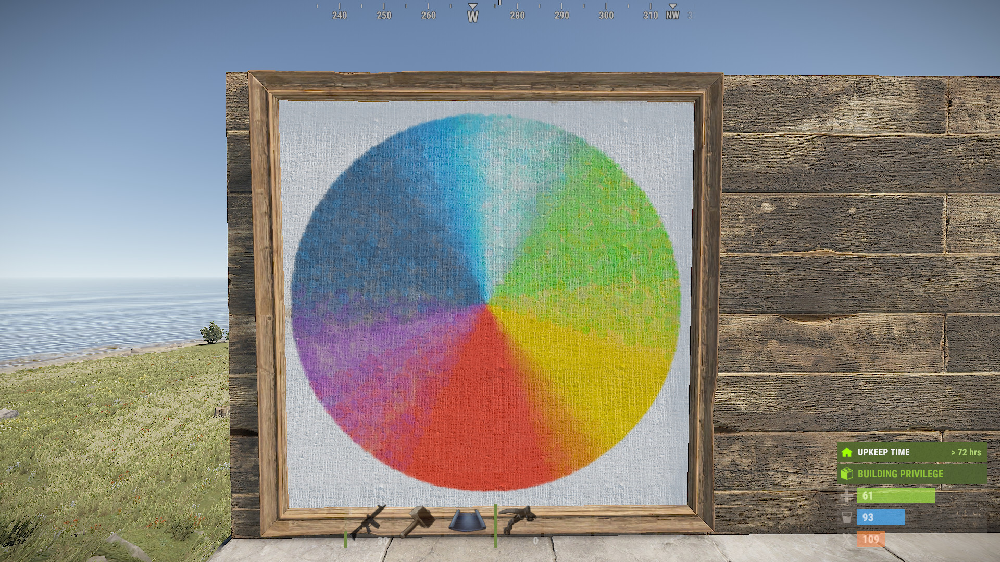

# Bob-Rust-Java

This project was made by HardCoded and Sekwah41.

HardCoded
* Design
* Shape optimization
* Generation optimization

Sekwah41
* Generation

If you have any problem with the program please create a new issue and tell us what went wrong.

# Usage
Check out our wiki for more information
[Wiki](https://github.com/Bob-Rust/Bob-Rust-Java/wiki)

# FAQ

## How many colors?
This tool can approximate most colors from the color spectrum.

## Can I get banned?
We have reached out to the Rust team and they told us that our application is ok.
We are still waiting for a response from the EAC team.
